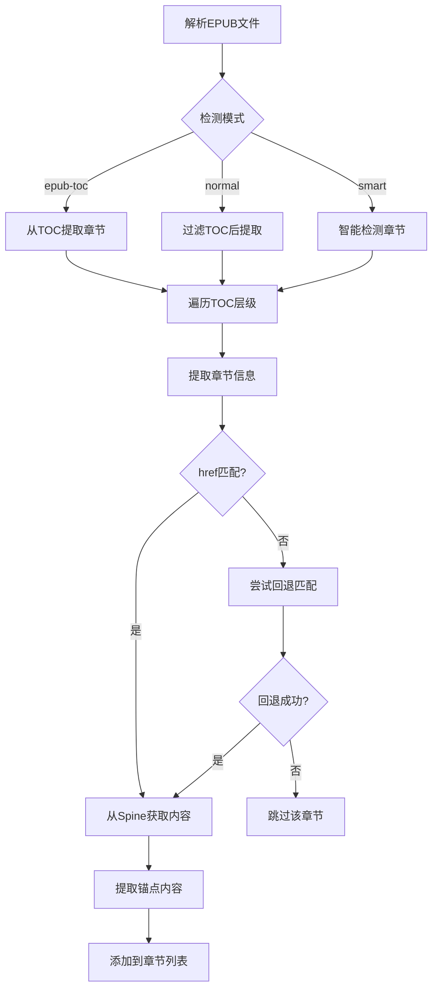

# EPUB Processor 规范

## 章节提取流程



## 关键算法

### href 匹配逻辑（MODIFIED）

**原逻辑**：
```typescript
if (spineItem.href === href || spineItem.href.endsWith(href))
```

**问题**：
- 无法处理路径顺序相反的情况
- 无法处理相对路径与绝对路径的混合

**新逻辑**：
```typescript
function matchHref(spineHref: string, tocHref: string): boolean {
  // 标准化路径
  const normalize = (path: string) => path.replace(/^\//, '').replace(/\\/g, '/')
  const normalizedSpine = normalize(spineHref)
  const normalizedToc = normalize(tocHref)
  
  // 精确匹配
  if (normalizedSpine === normalizedToc) return true
  
  // 后缀匹配（双向）
  if (normalizedSpine.endsWith(normalizedToc)) return true
  if (normalizedToc.endsWith(normalizedSpine)) return true
  
  // 文件名匹配（忽略路径）
  const spineFile = normalizedSpine.split('/').pop()
  const tocFile = normalizedToc.split('/').pop()
  if (spineFile === tocFile) return true
  
  return false
}
```

### 锚点内容提取（MODIFIED）

**原逻辑**：
- 只提取锚点元素本身
- 或提取锚点后的全部内容

**新逻辑**：
- 提取锚点到下一个锚点之间的内容
- 支持章节边界检测

```typescript
function extractAnchorRange(doc: Document, anchor: string): string {
  const anchorEl = doc.querySelector(`[id="${anchor}"], [name="${anchor}"]`)
  if (!anchorEl) return ''
  
  // 查找下一个章节锚点作为结束边界
  const allAnchors = doc.querySelectorAll('[id], [name]')
  let endEl: Element | null = null
  let found = false
  
  for (const el of allAnchors) {
    if (found && (el.tagName.match(/^H[1-6]$/))) {
      endEl = el
      break
    }
    if (el === anchorEl) found = true
  }
  
  // 提取 anchorEl 到 endEl 之间的内容
  // ...
}
```

## 数据类型

### ChapterData

```typescript
interface ChapterData {
  id: string           // 章节唯一标识
  title: string        // 章节标题
  content: string      // 章节内容（纯文本）
  href?: string        // 章节href路径（用于定位）
  tocItem?: NavItem    // 原始TOC项目信息
  depth?: number       // 章节层级深度
  anchor?: string      // ADDED: 锚点标识（如果有）
}
```

## 错误处理

- 当章节匹配失败时，记录警告日志
- 提供回退机制：尝试多种匹配策略
- 如果所有匹配都失败，跳过该章节而不是抛出错误
